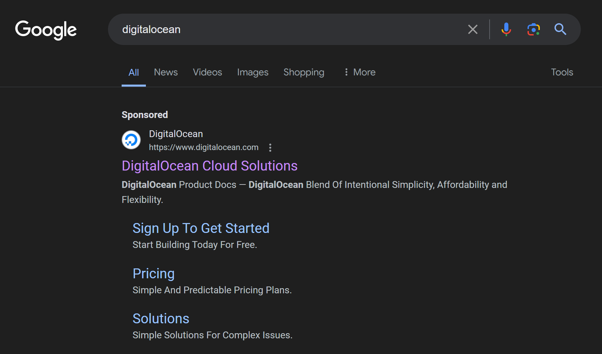
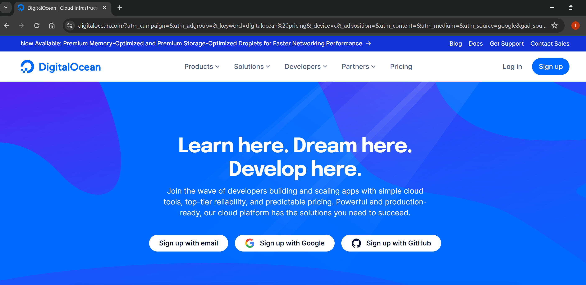
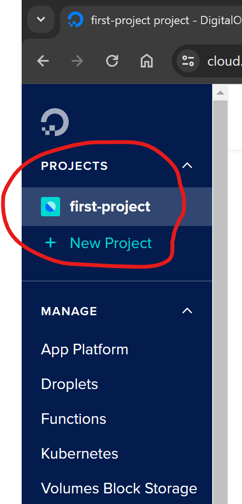
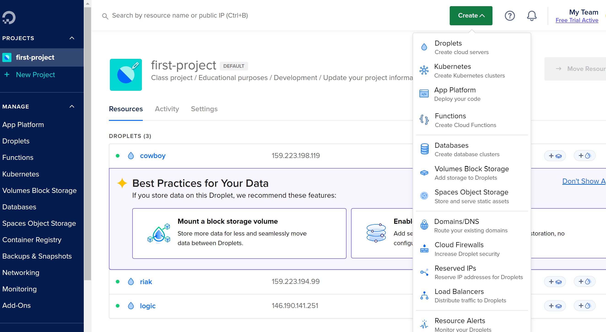

# Digital Ocean Setup
  
## Go to the Digital Ocean website

[page](https://www.digitalocean.com/)

## Signup

**Make a Student Account**

## Project

**Go down and make your first project**

## Create Droplets

1. Cowboy Droplet
2. Riak Droplet
3. Logic Droplet

