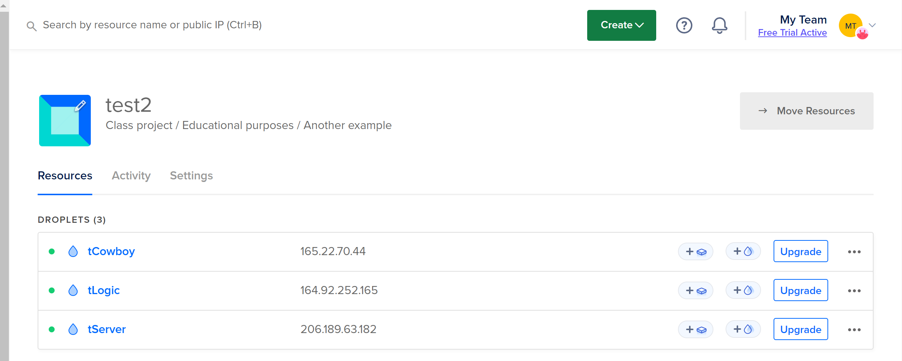
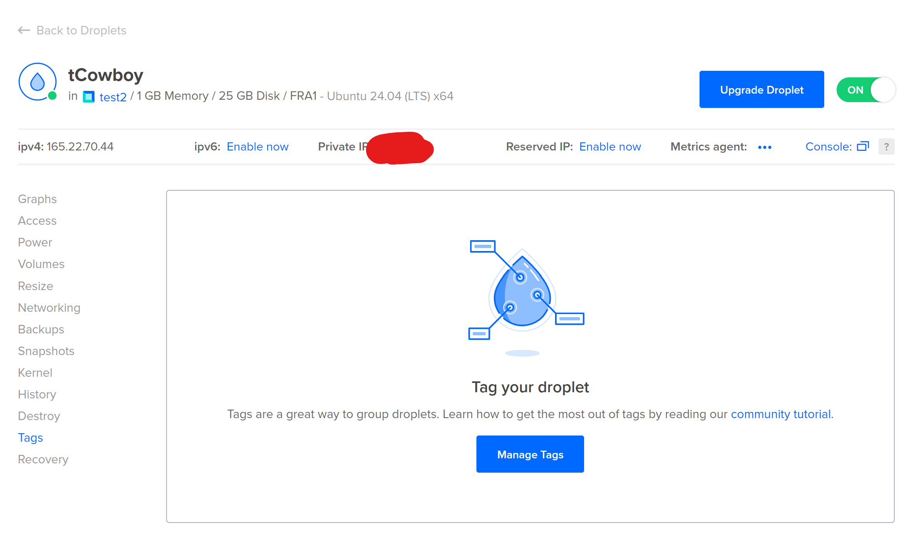
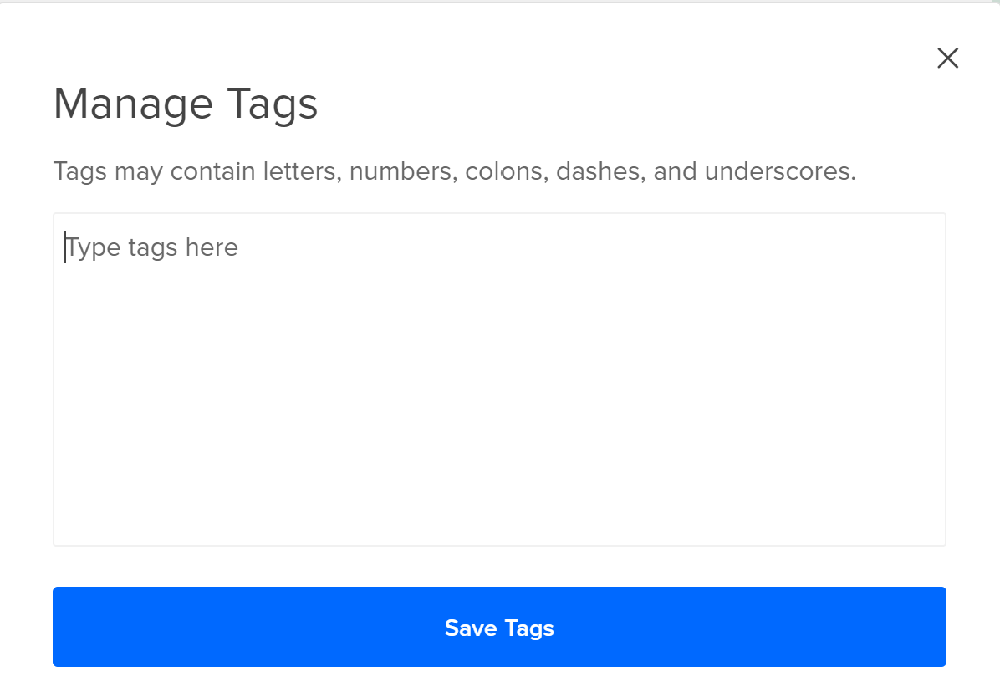
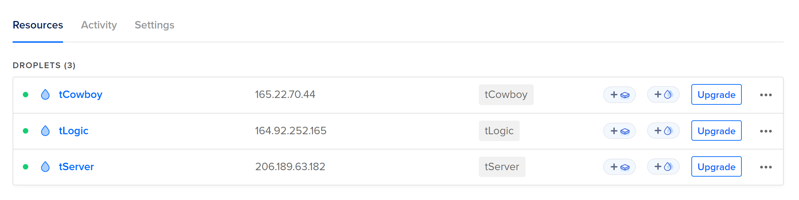

# Project Setup and Configuration

## Assign Sub-domains

1. Assign a unique, appropriately named sub-domain to each of your Digital Ocean droplets.

**Example**:









## Design Firewalls

1. Use the `Front_Firewall.png` and `Back_Firewall.png` in the team file to design the firewalls in Digital Ocean in the networking tab.

## Create Rebar3 Project

1. Create a Rebar3 project on your web service server using Cowboy to handle web traffic.
2. Store this project in a GitHub repository called `tracker_service`.

    ```bash
    rebar3 new release tracker_service
    cd tracker_service
    ```

## Cert Bot Setup

1. Use Cert Bot to obtain SSL certificates for your domain. Follow the example setup below:

    ```bash
    sudo apt-get update
    sudo apt-get install certbot
    sudo certbot certonly --standalone -d your_domain.com
    ```

2. Make sure to install it specifically in your Cowboy server and not on your local machine.

## Create Cowboy Handler

1. Create a Cowboy handler to send ‘hello world’ back out to your client.

    ```erlang
    -module(hello_handler).
    -behaviour(cowboy_http_handler).

    -export([init/3, handle/2, terminate/3]).

    init(Req, State, _Opts) ->
        {cowboy_http:loop, Req, State}.

    handle(Req, State) ->
        Req2 = cowboy_req:reply(200, #{<<"content-type">> => <<"text/plain">>}, <<"Hello, world!">>, Req),
        {ok, Req2, State}.

    terminate(_Reason, _Req, _State) ->
        ok.
    ```

## Choose JSON Library

1. As a team, decide which JSON library to use for your project.
2. Experiment with the chosen library in a junk Rebar3 repo on a local machine.

## Create Handlers for Message Types

1. Create a Cowboy handler for each message type in the provided data protocol contract.

    ```erlang
    -module(json_handler).
    -behaviour(cowboy_http_handler).

    -export([init/3, handle/2, terminate/3]).

    init(Req, State, _Opts) ->
        {cowboy_http:loop, Req, State}.

    handle(Req, State) ->
        {ok, Body, Req2} = cowboy_req:body(Req),
        %% Assuming json:decode/1 is the function from the chosen JSON library
        {ok, JSON} = json:decode(Body),
        %% Process JSON and create response
        Response = process_json(JSON),
        Req3 = cowboy_req:reply(200, #{<<"content-type">> => <<"application/json">>}, Response, Req2),
        {ok, Req3, State}.

    process_json(JSON) ->
        %% Example function to process JSON and create a response
        Response = #{<<"message">> => <<"Received JSON">>, <<"data">> => JSON},
        json:encode(Response).

    terminate(_Reason, _Req, _State) ->
        ok.
    ```

## Test with Postman

1. Use Postman to send JSON data to your web service according to the provided data protocol contract.
2. Use your chosen JSON library to decode the JSON text and echo a unique, hardcoded response to each request.
    - Ensure each handler processes the JSON data correctly and sends the appropriate response.
    - Verify the functionality by checking the responses in Postman.

# GitHub Repository

- Store all your code and configurations in the `tracker_service` repository on GitHub.
