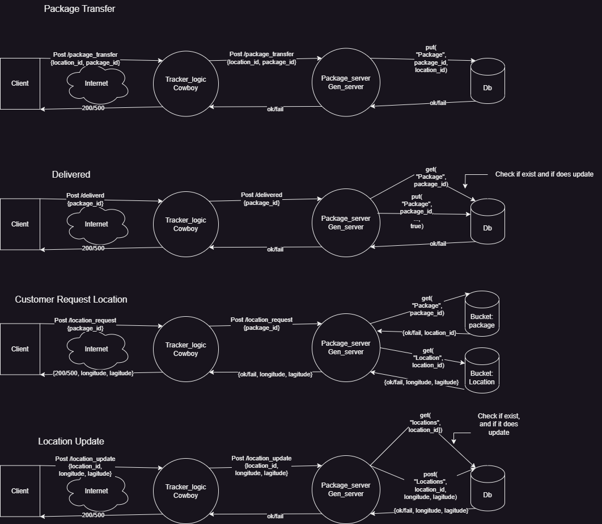

# Project Plan

## Goals

- Ensure reliable package tracking and status updates.
- Maintain a scalable and fault-tolerant system for handling package transfers and location updates.
- Provide accurate and timely information to clients about package status and location.

## How to Make

- The project needs 2 firewalls to secure the communication between clients and servers, and between servers and the database.

## Pieces

1. **Package Transfer**
    - Clients initiate a package transfer by sending a POST request to `/package_transfer` with `location_id` and `package_id`.
    - The request goes through the internet and is handled by the `Tracker_logic` Cowboy process.
    - The Cowboy process forwards the request to the `Package_server` GenServer.
    - The GenServer updates the database with the new package location.

2. **Delivered**
    - Clients update the package status to delivered by sending a POST request to `/delivered` with `package_id`.
    - The request is handled by the `Tracker_logic` Cowboy process and forwarded to the `Package_server` GenServer.
    - The GenServer updates the package status in the database.

3. **Request Location**
    - Clients request the location of a package by sending a POST request to `/location_request` with `package_id`.
    - The request is handled by the `Tracker_logic` Cowboy process and forwarded to the `Package_server` GenServer.
    - The GenServer retrieves the location information from the database and returns it to the client.

4. **Location Update**
    - Clients update the location information by sending a POST request to `/location_update` with `location_id`, `longitude`, and `latitude`.
    - The request is handled by the `Tracker_logic` Cowboy process and forwarded to the `Package_server` GenServer.
    - The GenServer updates the location information in the database.

## Structure for this Team

